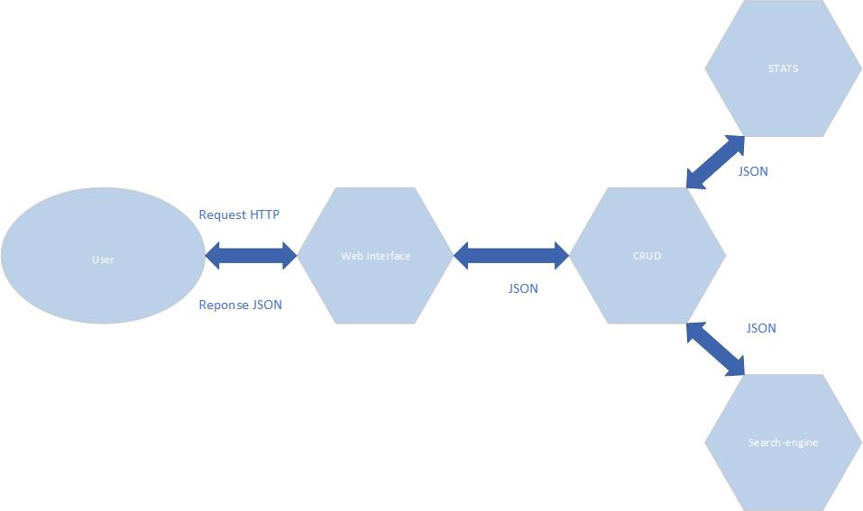

# Project Master 2 Informatique

> L'idee generale de ce projet est de proposer une api REST afin de gérer des demandes de travaux à l'aide de la bibliotheque Seneca.

### Installation

```
cd [mon_service_directory]
npm install
node main.js
```

### Prerequisites

```
node > 8.*
```

## Présentation de l'application

Seneca fonctionne sur le concept d'échange de messages et permet de crée des architectures microservices ou chaque composant est indépendant.
La solution développée permet de gérer une liste de demandes de travaux (DT) à partir d'une API REST à travers le Framework Seneca constitué des micro-services suivants :
1- Web-interface : Reçoit les requêtes HTTP, et les acheminent vers les microservices correspondent.
2- dt-pin-service : Réalise les opérations CRUD. 
3- dt-stats : fournis des statistiques a propos les DT crées.
4- dt-search-engine : gère un moteur d’indexation.

### Représentation schématique de l'architecture



### Messages échangés par l'application

#### Implémentation CRUD (dt-pin-service)

| action                            | notes                                                                |
|-----------------------------------|----------------------------------------------------------------------|
| role:dt,cmd:GET                   | list all DT objects in DB                                            |
| role:dt,cmd:POST,data:\*          | create DT object with provided data                                  |
| role:dt,cmd:PUT,id:\*,data:\*     | update DT                                                            |
| role:dt,cmd:DELETE,id:\*          | delete DT, all with 'opened' state if if not provided                |

#### Gestion des statistiques (dt-stats)

| action                                       | notes                                                             |
|----------------------------------------------|-------------------------------------------------------------------|
| role:stats,info:dt,cmd:POST,applicant:\*     | increment counter for provided applicant                          |
| role:stats,info:dt,cmd:PUT,applicant:\*      | update counter for provided applicant if needed depend on DT state|
| role:stats,info:dt,cmd:DELETE,applicant:\*   | decrement counter                                                 |
| role:stats                                   | get global stats                                                  |
| role:stats,applicant:*                       | get stats for specific user                                       |

#### Gestion de l'indexation (dt-search-engine)

| action                                      | notes                                                      |
|---------------------------------------------|------------------------------------------------------------|
| role:engine,info:dt,cmd:index,dt:\*         | index dt                                                   |
| role:engine,info:dt,cmd:search,q:\*         | search by query                                            |
| role:engine,info:dt,cmd:update,dt:\*        | update index if needed                                     |
| role:engine,info:dt,cmd:delete,dt:\*        | delete an indexed value                                    |

#### Web Interface

| method    | route              | action                 | call action                                                 | notes               |
|-----------|--------------------|------------------------|-------------------------------------------------------------|---------------------|
| GET       | /api/dt/:id?       | role:api,path:dt...    | role:dt,cmd:GET,?id:\*                                      | cf. dt-pin-service  |
| POST      | /api/dt            | role:api,path:dt...    | role:dt,cmd:POST,data:{applicant:\*,work:\*,state:\*}       |         ""          |
| PUT       | /api/dt/:id        | role:api,path:dt...    | role:dt,cmd:PUT,id:\*,data:{applicant:\*,work:\*,state:\*}  |         ""          |
| DELETE    | /api/dt            | role:api,path:dt...    | role:dt,cmd:DELETE,id:\*                                    |         ""          |
| GET       | /api/stats/:user?  | role:api,path:stats... | role:stats,?applicant:user                                  | cf. dt-stats        |
| GET       | /api/engine/:query | role:api,path:engine...| role:engine,info:dt,cmd:search,q:\*                         | cf. dt-search-engine|

## Test

package de test disponible dans le répertoire `test/` deux client sont fournit, certaines routes ont ete changees dans le client de base 
